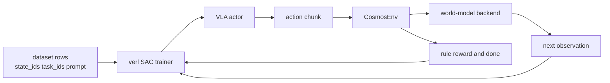
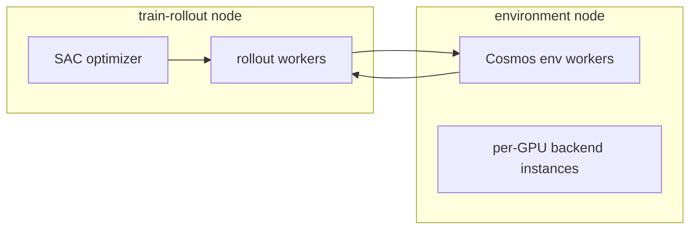

# Cosmos online world-model integration for `verl.experimental.vla`

## Core idea

`CosmosEnv` makes a world model look like a standard online RL environment.

## What is implemented

- A new `simulator_type=cosmos` path in `verl.experimental.vla`.
- `CosmosEnv`, which matches the existing env-worker contract.
- A default `mock` backend for smoke tests.
- A `cosmos_predict2` stub backend that validates the repo and Python import path.
- Single-node and disaggregated multi-node SAC launch scripts.

## Why the backend defaults to `mock`

The official `cosmos-predict2.5` robot action-conditioned flow is documented as file-oriented and single-GPU. The first integration pass therefore focuses on:

- preserving the trainer and env-worker contract
- validating resource partitioning across train and env GPUs
- making the online `step()` loop testable in the current repo

## Resource split

This follows the current VLA scheduling knobs:

- `trainer.n_env_gpus_per_node`
- `trainer.n_rollout_gpus_per_node`
- `env.disagg_sim.enable`
- `env.disagg_sim.nnodes`

## Why this fits `verl`

The integration is minimally invasive because `verl.experimental.vla` already expects environments to provide:

- `reset_envs_to_state_ids(...)`
- `chunk_step(...)`
- observations with `full_image`, `wrist_image`, `state`, and `task_descriptions`

That means the world model can be introduced as an environment adapter without rewriting the SAC trainer.
