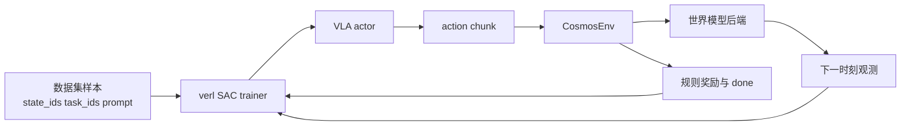
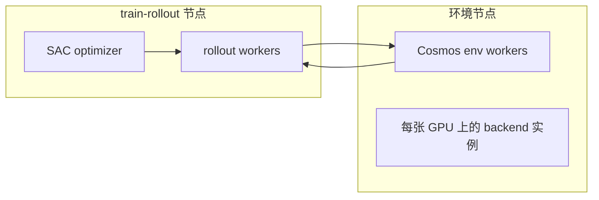

# `verl.experimental.vla` 中的 Cosmos 在线世界模型接入说明

## 核心思路

`CosmosEnv` 的目标是把世界模型包装成一个标准的在线 RL 环境。

## 已实现内容

- `verl.experimental.vla` 中新增 `simulator_type=cosmos`。
- 新增 `CosmosEnv`，保持与现有 env worker 一致的接口契约。
- 默认提供 `mock` 后端用于 smoke test。
- 预留 `cosmos_predict2` stub 后端，用于校验 `third_party/cosmos-predict2.5` 的仓库路径和 Python 导入链路。
- 提供单机和多节点分离的 SAC 启动脚本。

## 为什么默认后端是 `mock`

官方 `cosmos-predict2.5` 机器人 action-conditioned 流程当前仍以文件输入输出为主，且文档说明是单卡路径。因此第一版集成优先保证：

- trainer 和 env worker 契约不变
- 训练 GPU 与环境 GPU 的资源切分可用
- 当前仓库里可以稳定测试在线 `step()` 闭环

## 资源切分

这直接复用了当前 VLA 的调度配置：

- `trainer.n_env_gpus_per_node`
- `trainer.n_rollout_gpus_per_node`
- `env.disagg_sim.enable`
- `env.disagg_sim.nnodes`

## 为什么适合现有 `verl`

因为 `verl.experimental.vla` 已经要求环境提供：

- `reset_envs_to_state_ids(...)`
- `chunk_step(...)`
- 以及 `full_image`、`wrist_image`、`state`、`task_descriptions` 这些观测字段

因此这次可以把世界模型先作为环境适配层接入，而不需要重写 SAC trainer。
