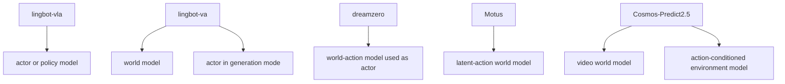
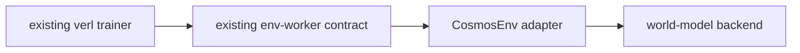

# External VLA and world-model role analysis for `verl`

## High-level map

## Repo-by-repo readout

### `lingbot-vla`

- Repo: `https://github.com/Robbyant/lingbot-vla`
- Paper: `https://arxiv.org/abs/2601.18692`
- Primary role in RL: actor or policy model
- Implementation read: training and deployment are centered on a VLA stack and policy serving
- Best `verl` fit: `actor_rollout_ref` policy backend or post-SFT initialization source
- Not the best fit as: an online environment backend

### `lingbot-va`

- Repo: `https://github.com/Robbyant/lingbot-va`
- Paper: `https://arxiv.org/abs/2601.21998`
- Primary role in RL: world model, and sometimes actor
- Implementation read: it models video-action causality, so it can simulate futures or directly produce action trajectories
- Best `verl` fit:
  - an external environment backend when used as a simulator
  - an actor backend when used in direct action-generation mode
- Caveat: serving and batching semantics must be adapted to `verl` env-worker or rollout-worker contracts

### `dreamzero`

- Repo: `https://github.com/dreamzero0/dreamzero`
- Paper: `https://arxiv.org/abs/2602.15922`
- Primary role in RL: actor, specifically a world-action model used directly as policy
- Implementation read: the method treats the world-action model itself as the decision-making policy
- Best `verl` fit: actor backend, not environment backend
- Caveat: adaptation belongs near `actor_rollout_ref`, not `EnvWorker`

### `Motus`

- Repo: `https://github.com/thu-ml/Motus`
- Paper: `https://arxiv.org/abs/2512.13030`
- Primary role in RL: latent-action world model or planner backbone
- Implementation read: it emphasizes unified latent action world modeling more than plain policy decoding
- Best `verl` fit:
  - external environment model backend
  - planner or model-based rollout helper
- Caveat: latent action interfaces do not directly match the current explicit continuous action contract in `verl.experimental.vla`

### `cosmos-predict2.5`

- Repo: `https://github.com/nvidia-cosmos/cosmos-predict2.5`
- Docs: official robot action-conditioned inference and robot policy recipe paths
- Primary role in RL: world model environment backend
- Secondary role in RL: policy post-training recipe source
- Best `verl` fit: environment backend first, actor-side experimentation later

## Fit summary

| Repo | Natural RL role | Best `verl` attachment point | Fit | Why |
| --- | --- | --- | --- | --- |
| `lingbot-vla` | actor | `actor_rollout_ref` | High | already actor-shaped |
| `lingbot-va` | world model or actor | env backend or actor | Medium-High | dual-use but needs interface adaptation |
| `dreamzero` | actor | `actor_rollout_ref` | Medium-High | world-action model acts as policy |
| `Motus` | world model | env backend or planning layer | Medium | latent action mismatch |
| `cosmos-predict2.5` | world model | env backend | Medium-High | official action-conditioned robotics path exists |

## Why `CosmosEnv` is the least disruptive first step

Using world models as environments preserves the current RL trainer assumptions:

- the actor stays an actor
- reward is still computed in the environment wrapper
- rollout workers still request actions from the policy
- env workers still own `reset` and `step`

By contrast, using DreamZero or LingBot-VA directly as the actor would require policy-side adaptation, model IO reshaping, and likely a new serving path.
