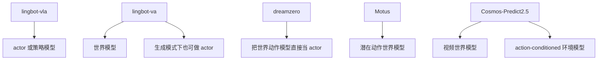
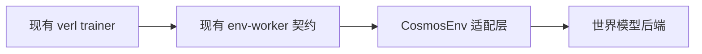

# 面向 `verl` 的外部 VLA / 世界模型角色分析

## 总体映射

## 逐仓库分析

### `lingbot-vla`

- 仓库：`https://github.com/Robbyant/lingbot-vla`
- 论文：`https://arxiv.org/abs/2601.18692`
- 在 RL 中的主要角色：actor / policy model
- 实现特征：训练和部署都围绕 VLA 模型与策略服务展开
- 最适合挂到 `verl` 的位置：`actor_rollout_ref` 或 RL 前的 SFT 初始化来源
- 不适合作为：在线环境后端

### `lingbot-va`

- 仓库：`https://github.com/Robbyant/lingbot-va`
- 论文：`https://arxiv.org/abs/2601.21998`
- 在 RL 中的主要角色：世界模型，也可能充当 actor
- 实现特征：建模 video-action 因果关系，因此既可以用于未来仿真，也可以直接产生动作轨迹
- 最适合挂到 `verl` 的位置：
  - 当它被当作仿真器时，可挂成外部环境后端
  - 当它直接生成动作时，可挂成 actor 后端
- 主要难点：服务与批处理接口需要适配 `verl` 的 env worker 或 rollout worker 契约

### `dreamzero`

- 仓库：`https://github.com/dreamzero0/dreamzero`
- 论文：`https://arxiv.org/abs/2602.15922`
- 在 RL 中的主要角色：actor，也就是把世界动作模型本身当策略
- 实现特征：核心观点就是世界动作模型本身就是 zero-shot policy
- 最适合挂到 `verl` 的位置：actor 后端，而不是环境后端
- 主要难点：适配点更接近 `actor_rollout_ref`，而不是 `EnvWorker`

### `Motus`

- 仓库：`https://github.com/thu-ml/Motus`
- 论文：`https://arxiv.org/abs/2512.13030`
- 在 RL 中的主要角色：潜在动作世界模型 / planner backbone
- 实现特征：强调统一的 latent action world model，而不是直接的策略解码
- 最适合挂到 `verl` 的位置：
  - 外部环境模型后端
  - planner 或 model-based rollout 辅助模块
- 主要难点：潜在动作接口和当前 `verl.experimental.vla` 的显式连续动作接口不直接兼容

### `cosmos-predict2.5`

- 仓库：`https://github.com/nvidia-cosmos/cosmos-predict2.5`
- 文档：官方提供机器人 action-conditioned inference 与 robot policy recipe
- 在 RL 中的主要角色：世界模型环境后端
- 次要角色：策略后训练配方来源
- 最适合挂到 `verl` 的位置：优先作为环境后端，之后再探索 actor 侧接法

## 适配总结

| 仓库 | 自然 RL 角色 | 最适合挂到 `verl` 的位置 | 适配度 | 原因 |
| --- | --- | --- | --- | --- |
| `lingbot-vla` | actor | `actor_rollout_ref` | 高 | 结构天然是 actor |
| `lingbot-va` | 世界模型或 actor | 环境后端或 actor | 中高 | 双用途，但接口需要适配 |
| `dreamzero` | actor | `actor_rollout_ref` | 中高 | 世界动作模型直接当策略 |
| `Motus` | 世界模型 | 环境后端或 planning 层 | 中等 | latent action 接口不一致 |
| `cosmos-predict2.5` | 世界模型 | 环境后端 | 中高 | 官方已有机器人 action-conditioned 路径 |

## 为什么先做 `CosmosEnv` 最不扰动现有 `verl`

把世界模型先当环境来接入，可以保留现有 RL 训练假设：

- actor 仍然是 actor
- reward 仍然由环境包装层计算
- rollout worker 仍然向策略要动作
- env worker 仍然负责 `reset` 和 `step`

相比之下，如果把 DreamZero 或 LingBot-VA 直接当 actor 接入，就需要改模型 IO、预处理链路和策略服务路径。
