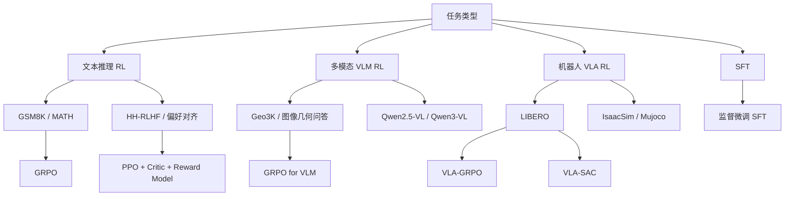

# verl 仓库中的任务类型与训练模式对照

本文整理了当前仓库里最常见的几类任务，以及它们对应的训练模式差异，方便快速判断：

- 这是文本 RL、VLM RL、VLA RL，还是纯 SFT。
- 奖励信号来自规则、reward model，还是环境交互。
- 训练时是否需要 critic。
- 是 on-policy 还是 off-policy。

## 一张图看懂

## 任务映射

| 类别 | 代表脚本 | 任务内容 | 奖励来源 | 典型算法 |
| --- | --- | --- | --- | --- |
| 文本 RL | `examples/grpo_trainer/run_qwen2-7b.sh` | `GSM8K` 数学推理 | 规则/函数奖励 | `GRPO` |
| 多模态 RL | `examples/grpo_trainer/run_qwen2_5_vl-7b.sh` | `Geo3K` 图像几何问答 | 规则/函数奖励 | `GRPO` |
| 偏好对齐 RLHF | `examples/ppo_trainer/run_deepseek_full_hh_rlhf.sh` | `HH-RLHF` 偏好对齐 | `reward model` | `PPO` |
| 混合推理 RLHF | `examples/ppo_trainer/run_qwen2-7b_rm.sh` | `GSM8K + MATH` | `reward model` | `PPO` |
| VLA RL | `verl/experimental/vla/run_simpleVLA_libero_grpo.sh` | `LIBERO` 机器人控制 | 环境交互奖励 | `GRPO` 变体 |
| VLA RL | `verl/experimental/vla/run_pi05_libero_sac.sh` | `LIBERO` 机器人控制 | 环境交互奖励 | `SAC` |
| SFT | `examples/sft/vlm/run_qwen3_vl_2b.sh` | VLM 监督微调 | 无 RL reward | `SFT` |

## 这些任务具体在做什么

### 1. 文本推理 RL

- 典型数据：`GSM8K`、`MATH`。
- 模型输出一段推理和最终答案。
- 奖励通常来自可验证规则，比如答案是否正确。
- 适合 `GRPO`，因为这类任务容易做组内相对比较，不一定需要单独 critic。

对应脚本：

- `examples/grpo_trainer/run_qwen2-7b.sh`
- `examples/ppo_trainer/run_qwen2-7b_rm.sh`

### 2. 多模态 VLM RL

- 典型数据：`Geo3K` 这种带图像的几何/视觉推理数据。
- 输入是文本 + 图像，输出是多步推理与答案。
- 奖励仍然常是规则可验证的，比如最终解题正确性。
- 这类任务和文本 RL 的训练范式相近，但模型前向包含视觉编码器，显存和 rollout 成本更高。

对应脚本：

- `examples/grpo_trainer/run_qwen2_5_vl-7b.sh`

### 3. 偏好对齐 RLHF

- 典型数据：`HH-RLHF` 等偏好数据。
- 任务不是“算出标准答案”，而是让模型更符合偏好、对齐、安全性或 helpfulness。
- 奖励不一定能通过规则直接写出来，因此常用单独的 `reward model` 打分。
- 这正是 `PPO + critic + reward model` 最典型的使用场景。

对应脚本：

- `examples/ppo_trainer/run_deepseek_full_hh_rlhf.sh`

### 4. VLA RL

- `VLA` 指 `Vision-Language-Action`，目标不是生成文本答案，而是生成机器人动作。
- 模型和环境反复交互：观察 -> 生成动作 -> 环境执行 -> 返回新观察和奖励。
- 这里的“rollout”是真实的环境轨迹，而不仅是文本采样。
- 仓库当前提供的是实验性支持，重点在 `LIBERO`、`IsaacSim`、`Mujoco` 这些机器人/仿真环境。

对应脚本：

- `verl/experimental/vla/run_simpleVLA_libero_grpo.sh`
- `verl/experimental/vla/run_pi05_libero_sac.sh`

## 训练模式对照

| 维度 | `PPO` | `GRPO` | `VLA-GRPO` | `SAC` | `SFT` |
| --- | --- | --- | --- | --- | --- |
| 是否 RL | 是 | 是 | 是 | 是 | 否 |
| 是否需要 critic | 需要 | 不需要 | 通常不需要 | 通常有 value/Q 结构 | 不需要 |
| 数据来源 | 静态 prompt 数据 + rollout | 静态 prompt 数据 + group rollout | 环境交互轨迹 | 环境交互轨迹 + replay buffer | 静态标注数据 |
| 奖励来源 | reward model 或规则奖励 | 组内相对奖励/规则奖励 | 环境奖励 | 环境奖励 | 无 |
| 是否 on-policy | 是 | 是 | 是 | 否 | 不适用 |
| 是否多次采样同一输入 | 可选 | 核心机制 | 常见 | 非核心 | 否 |
| 典型优势估计 | `GAE` | group-relative advantage | group-relative / reinforce++ 风格 | Q-value / off-policy target | 无 |
| 适合的任务 | RLHF、偏好对齐 | 数学、代码、可验证推理 | 机器人策略优化 | 样本昂贵的连续控制 | 模仿学习/初始化 |

## 几个最关键的区别

### PPO

- 需要 `actor + critic`。
- 优势函数常用 `GAE`。
- 很适合 `reward model` 驱动的 RLHF。
- 训练更“标准化”，但资源成本通常高于无 critic 的方法。

仓库里可以直接看到：

- `examples/ppo_trainer/README.md`
- `examples/ppo_trainer/run_deepseek_full_hh_rlhf.sh`

### GRPO

- 不训练单独 critic。
- 对同一 prompt 采样多次，用组内相对奖励作为 baseline。
- 特别适合答案可验证的任务，比如数学、代码、规则判分任务。
- 训练成本往往低于 PPO，但通常要求 `rollout.n > 1`。

仓库里可以直接看到：

- `examples/grpo_trainer/README.md`
- `examples/grpo_trainer/run_qwen2-7b.sh`

### VLA-GRPO

- 算法思想接近 `GRPO`，但训练对象从“文本输出”变成“动作序列”。
- 核心难点不是只在 loss 上，而是在环境仿真与模型推理的并发调度。
- 仓库里专门使用了 `async_envloop` 和 pipeline stage 来重叠环境执行与模型生成。
- 这说明 VLA RL 的系统问题比文本 RL 更重。

仓库里可以直接看到：

- `verl/experimental/vla/README.md`
- `verl/experimental/vla/run_simpleVLA_libero_grpo.sh`

### SAC

- `SAC` 是 off-policy 方法，和 `PPO/GRPO` 这类 on-policy 路线不同。
- 更适合样本代价高、希望复用历史轨迹的连续控制问题。
- 在机器人控制里很常见，因为环境交互昂贵，经验回放很重要。

仓库里可以直接看到：

- `verl/experimental/vla/run_pi05_libero_sac.sh`

### SFT

- 不是 RL，只是监督学习。
- 往往用来做初始模型，再进入 PPO/GRPO/SAC。
- 在 VLA 里，SFT 模型通常也会作为 RL 初始化权重。

仓库里可以直接看到：

- `examples/sft/vlm/run_qwen3_vl_2b.sh`
- `verl/experimental/vla/run_simpleVLA_libero_grpo.sh`

## 如何快速判断该看哪个例子

- 如果你关心“数学/代码/可验证答案”，先看 `GRPO`。
- 如果你关心“人类偏好对齐 / reward model”，先看 `PPO`。
- 如果你关心“图像输入 + 推理”，看 `VLM GRPO`。
- 如果你关心“机器人动作控制”，看 `VLA-GRPO` 或 `VLA-SAC`。
- 如果你只是想找最容易理解的训练入口，先从 `SFT -> GRPO/PPO` 这条路径看。

## 推荐阅读顺序

1. `examples/grpo_trainer/README.md`
2. `examples/ppo_trainer/README.md`
3. `examples/grpo_trainer/run_qwen2-7b.sh`
4. `examples/grpo_trainer/run_qwen2_5_vl-7b.sh`
5. `verl/experimental/vla/README.md`
6. `verl/experimental/vla/run_simpleVLA_libero_grpo.sh`
7. `verl/experimental/vla/run_pi05_libero_sac.sh`

## 一句话总结

- 文本/多模态可验证任务：优先看 `GRPO`。
- 偏好对齐：优先看 `PPO + reward model`。
- 机器人控制：重点看 `VLA-GRPO` 和 `VLA-SAC`。
- `VLA` 和普通 LLM RL 最大的区别，不只是模型输入输出变了，而是训练过程里真的引入了环境交互与仿真调度。
