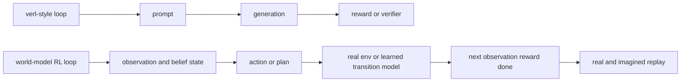
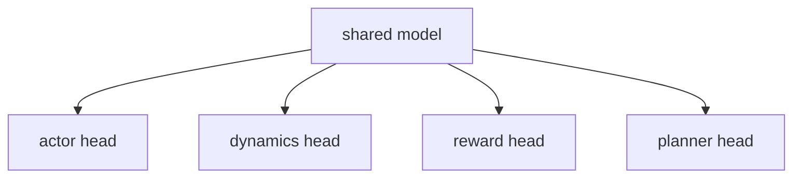
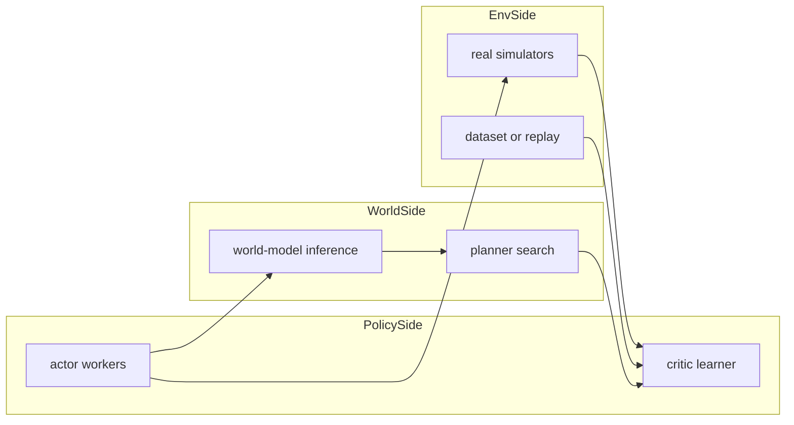

# A dedicated RL framework for world models and embodied robotics

## Thesis

A specialized framework should move from **generate then score** to **maintain state, act, imagine, transition, and learn over real plus imagined experience**.

## Why it differs from `verl`

`verl` is strongest when the central object is a generated sequence batch. A robotics/world-model framework should instead treat the central object as a transition system.

## Core abstractions

### 1. `EpisodeState`
A persistent state object that carries observations, proprioception, language goal, hidden memory, and simulator or world-model latent state.

### 2. `Observation`
A structured multimodal object instead of a prompt-only tensor batch.

### 3. `Action`
A first-class action type that can be continuous, discrete, chunked, latent, or tokenized.

### 4. `TransitionModel`
A role that advances the world, whether that world is a real simulator, a learned world model, or a hybrid runtime.

### 5. `TaskEvaluator`
A clean reward and termination interface independent from generation.

### 6. `Planner`
A first-class module for imagined rollouts, tree search, trajectory scoring, and receding-horizon control.

## Supporting world-action models

The key new concept should be a **role graph**.

A single model may act as actor, environment or dynamics model, planner backbone, and critic or value estimator.

This is where the framework should differ most from `verl`: the model graph is role-composable rather than split cleanly into policy generation and external reward.

## Data model and replay

The replay layer should be typed.

### Real transition
- `obs`
- `action`
- `next_obs`
- `reward`
- `done`
- `latent`
- `task`

### Imagined transition
The same structure, plus uncertainty, rollout source, planner branch id, and calibration metadata.

### Replay pools
- real replay
- imagined replay
- offline demonstration replay
- planner cache

This is more like a trajectory database than a prompt dataset.

## Distributed scheduling

A dedicated framework should schedule by role:

- actor workers
- world-model inference workers
- real simulator workers
- planner workers
- critic or learner workers
- replay service

## Most different from `verl`

- Not prompt-centric
- Not purely generation-centric
- The environment is programmable and may be learned
- Models can occupy multiple roles at once
- Replay is mixed-source and graph-like
- Planning is first-class

## How to support world-action models cleanly

A good design would expose four standard interfaces on a model or service:

- `forward_actor(observation, memory) -> action`
- `forward_dynamics(state, action, memory) -> next_state or next_observation`
- `forward_reward(state, action, next_state) -> reward, done`
- `forward_plan(state, budget) -> candidate trajectories or best action`

A deployment can then choose among three execution modes:

- decoupled actor plus world model
- shared-backbone multi-head model
- single world-action model that controls and imagines

## Practical takeaway for this repo

For the current `verl` tree, the least disruptive path remains:

- use `CosmosEnv` or similar as the environment backend
- keep the actor as a separate policy model
- add typed replay and planning later if moving toward a dedicated embodied framework
