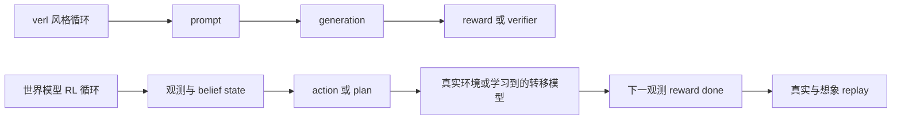
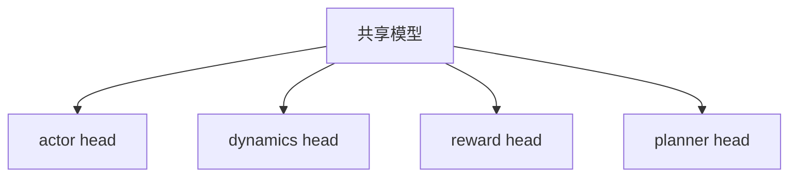
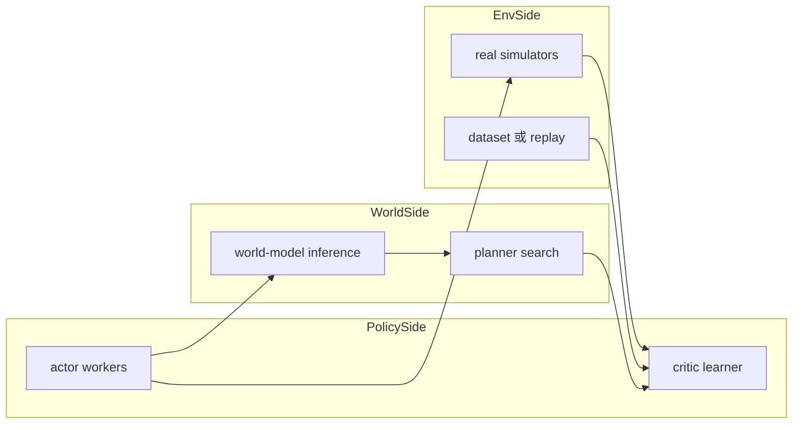

# 面向世界模型与具身机器人的专用 RL 框架设计

## 核心判断

专门的框架应该从 **generate then score** 转向 **维护状态、执行动作、进行想象、推进转移，并在真实经验与想象经验上共同学习**。

## 为什么它会和 `verl` 很不一样

`verl` 最擅长的场景，是核心对象仍然是“生成序列 batch”。而机器人 / 世界模型框架的核心对象应该是“转移系统”。

## 核心抽象

### 1. `EpisodeState`
一个持续存在的状态对象，里面包含观测、本体感觉、语言目标、隐式记忆以及模拟器或世界模型的 latent state。

### 2. `Observation`
它应该是结构化的多模态对象，而不是只有 prompt 的 tensor batch。

### 3. `Action`
动作应该是一等公民，可以是连续动作、离散动作、chunked action、latent action 或 tokenized action。

### 4. `TransitionModel`
它负责推进世界，不管这个世界是真实模拟器、学习到的世界模型，还是混合运行时。

### 5. `TaskEvaluator`
它提供独立于 generation 的奖励与终止接口。

### 6. `Planner`
它是一等公民模块，用来做 imagined rollout、树搜索、轨迹打分和 receding-horizon control。

## 如何支持 world-action model

关键新概念应该是 **role graph**。

同一个模型可能同时充当 actor、environment 或 dynamics model、planner backbone，以及 critic 或 value estimator。

这正是它和 `verl` 最大的差异：模型图是可组合角色的，而不是简单拆成 policy generation 加外部 reward。

## 数据模型与 replay

replay 层应该是 typed 的。

### 真实转移
- `obs`
- `action`
- `next_obs`
- `reward`
- `done`
- `latent`
- `task`

### 想象转移
结构相同，但额外带上不确定性、rollout 来源、planner branch id 和校准信息。

### replay 池类型
- real replay
- imagined replay
- offline demonstration replay
- planner cache

它更像“轨迹数据库”，而不是 prompt 数据集。

## 分布式调度

专门框架应该按角色调度：

- actor workers
- world-model inference workers
- real simulator workers
- planner workers
- critic 或 learner workers
- replay service

## 与 `verl` 最大的概念差异

- 不再 prompt-centric
- 不再纯 generation-centric
- 环境是可编程且可学习的
- 模型可以同时承担多个角色
- replay 是混合来源且更像图结构
- planning 是一等公民

## 如何优雅支持 world-action model

一个好的设计应当让模型或服务暴露四个标准接口：

- `forward_actor(observation, memory) -> action`
- `forward_dynamics(state, action, memory) -> next_state or next_observation`
- `forward_reward(state, action, next_state) -> reward, done`
- `forward_plan(state, budget) -> candidate trajectories or best action`

部署时再选择三种执行模式：

- 解耦的 actor 加 world model
- 共享 backbone 的 multi-head 模型
- 同时负责控制和想象的单一 world-action model

## 对当前仓库的实际启发

对现在的 `verl` 树来说，最少扰动的路线仍然是：

- 先把 `CosmosEnv` 这类东西作为环境后端
- actor 继续保持独立策略模型
- 如果后续真要走向专用 embodied framework，再引入 typed replay 和 planning
