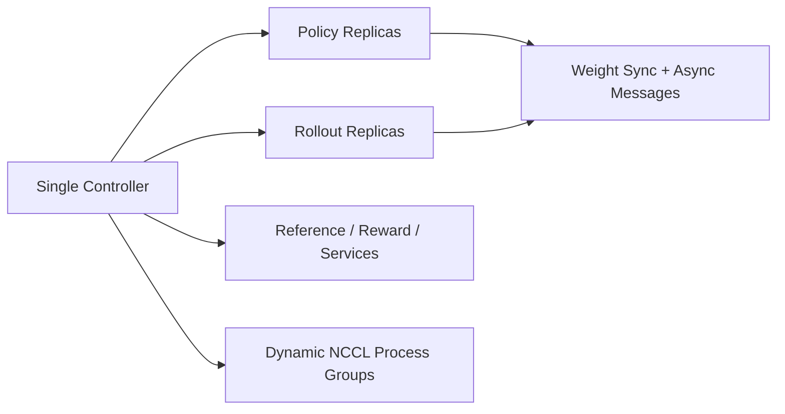
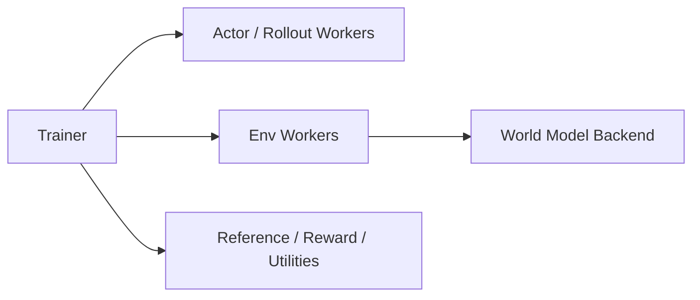

# Cosmos-RL vs verl

This note answers a practical question: can `third_party/cosmos-rl` run directly in the current `verl` cluster environment, and how is its architecture different from `verl`?

## Short answer

- On the bare host environment: **no**, not out of the box.
- On the current GH200 node with the existing ARM64 apptainer image: **yes**, but not fully out of the box; it needs a small compatibility layer for Python packages, `redis-server`, and `torchrun`.
- The successful smoke run on **March 8, 2026** was a `1 GPU` SFT example, not a full world-foundation-model RL or VLA training run.

## What `cosmos-rl` is

`cosmos-rl` is primarily an RL framework and distributed training runtime. It is not itself the world model. In the NVIDIA Cosmos stack:

- `cosmos-predict2.5` is the world model.
- `cosmos-rl` is the training/control framework that can orchestrate policy, rollout, reward, and world-foundation-model training jobs.

That distinction matters for `verl`: the most natural way to reuse Cosmos today is still to treat `cosmos-predict2.5` as an environment backend and keep `verl` as the trainer.

## Architecture at a glance

### `cosmos-rl`



Key traits:

- controller-centric orchestration
- replica specialization between policy and rollout
- asynchronous producer/consumer flow
- dynamic process-group management for large distributed jobs
- built for large-scale RL and physical-AI workloads, including WFM and VLA paths

### `verl`



Key traits:

- trainer/resource-pool-centric orchestration
- cleaner separation between actor and environment
- easier to surgically swap backends behind existing worker contracts
- originally optimized around LLM-generation RL loops, then extended toward VLA

## Biggest design difference

The biggest practical difference is where each framework places the system boundary.

- `cosmos-rl` treats **controller + replica lifecycle + async routing** as the center of the design.
- `verl` treats **trainer + worker contracts + resource placement** as the center of the design.

For embodied or world-model RL, this leads to different extension paths:

- in `cosmos-rl`, policy/rollout specialization and controller messaging are first-class
- in `verl`, the lowest-friction path is to add a new backend behind an existing contract such as `Env.step()`

This is why `CosmosEnv` is a cleaner first integration point for `verl` than trying to import `cosmos-rl` as a drop-in trainer replacement.

## Direct-run verdict in this environment

The repository is **not directly runnable on the bare host** in the current workspace environment, because the host Python lacks core packages such as `torch`, `ray`, and `omegaconf`.

Inside the available ARM64 apptainer image, the situation is much better but still not fully zero-touch:

- the image already provides GPU-enabled `torch`, `ray`, `omegaconf`, and `torchvision`
- `cosmos-rl` still needed extra Python packages such as `toml`, `diffusers`, `imageio`, and a Redis distribution
- the controller expects a `redis-server` executable
- the generated Redis config contains `tls-port 0`, which is rejected by the Redis 6.2 binary bundled by `redislite`
- `launch_replica.sh` invokes `torchrun`, so the run needed a wrapper to keep execution inside the venv where those extra packages were installed

So the correct answer is:

- **not directly runnable as-is on this host**
- **runnable with a small container-side compatibility shim**

## Reproducible smoke example

Use:

```bash
bash scripts/run_cosmos_rl_smoke_apptainer.sh
```

What it does:

- uses the ARM64 apptainer image at `~/code/verl_docker/verl_sgl056_arm64_latest.sif` by default
- creates a system-site-packages venv in `/tmp/cosmosrl_run_venv`
- installs only the missing Python packages required for a minimal SFT run
- provides wrapper scripts for `redis-server` and `torchrun`
- launches a `1 GPU` SFT smoke run with:
  - model: `Qwen/Qwen2.5-0.5B-Instruct`
  - dataset: `third_party/cosmos-rl/tests/data_fixtures/sharegpt52k_small`
  - training steps: `1`

## Run result collected on March 8, 2026

Environment:

- host: `nid010055`
- GPU: `1 x NVIDIA GH200 120GB`
- runtime: apptainer with the ARM64 `verl` image

Observed result:

- the controller started successfully
- the policy worker downloaded `Qwen/Qwen2.5-0.5B-Instruct`
- the local dataset with `10` samples loaded successfully
- training completed `Step: 1/1`
- reported training loss: `2.08973`
- safetensors export completed under `/tmp/cosmos_rl_smoke_output/.../safetensors/step_1`

This confirms that `cosmos-rl` can be executed successfully in the current cluster setup, but only after adding the compatibility layer above.

## What this does not prove yet

This smoke run does **not** prove that the full `cosmos-rl` WFM or VLA stack is ready in this environment.

Those higher-end paths still likely need more setup, for example:

- `vllm` or other rollout backends
- extra `wfm` dependencies
- reward services
- larger multi-GPU placements
- task-specific datasets and model checkpoints

So the smoke result should be interpreted as:

- the framework entry path is viable here
- the environment is not yet ready for every upstream example class without more packaging work

