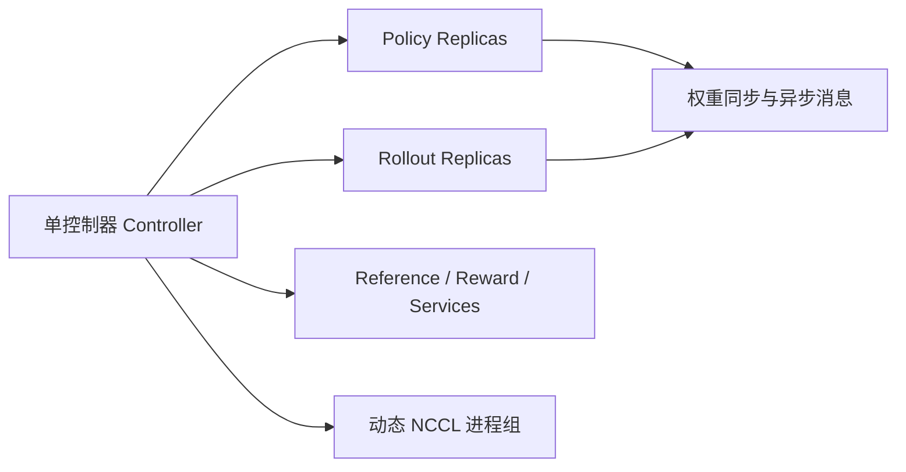
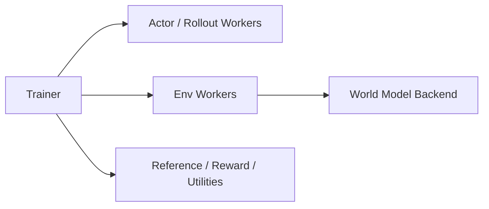

# Cosmos-RL 与 verl 架构对比

这份说明回答一个很实际的问题：`third_party/cosmos-rl` 在当前 `verl` 集群环境里能不能直接跑，以及它和 `verl` 的架构设计差别到底在哪里。

## 结论先说

- 在当前裸机宿主环境里：**不能直接开箱即跑**。
- 在当前 GH200 节点配合现有 ARM64 apptainer 镜像时：**可以跑**，但也不是完全零改动，需要一个很薄的兼容层来补 Python 包、`redis-server` 和 `torchrun`。
- 我在 **2026 年 3 月 8 日** 跑通的是一个 `1 GPU` 的 SFT smoke 例子，不是完整的 world foundation model RL，也不是完整 VLA 训练。

## `cosmos-rl` 本质上是什么

`cosmos-rl` 主要是一个 RL 框架和分布式训练运行时，本身并不是世界模型。在 NVIDIA Cosmos 体系里：

- `cosmos-predict2.5` 更像世界模型。
- `cosmos-rl` 更像负责组织 policy、rollout、reward 和 WFM 训练任务的控制框架。

这一点对 `verl` 很关键：现阶段最自然的复用方式，依然是把 `cosmos-predict2.5` 当成环境后端，而不是把 `cosmos-rl` 当作 `verl` 的直接 trainer 替换物。

## 架构直观对比

### `cosmos-rl`



它的核心特征是：

- 以 controller 为中心
- policy 和 rollout 做 replica specialization
- 强调 producer / consumer 异步流
- 把大规模分布式 RL 的进程组管理做成一等公民
- 直接面向 Physical AI、WFM、VLA 等复杂任务

### `verl`



它的核心特征是：

- 以 trainer / resource pool 为中心
- actor 和 environment 的边界更清晰
- 更容易在既有 worker contract 后面替换 backend
- 最早更偏向 LLM generation RL，然后再扩展到 VLA

## 最大的设计差异

两者最大的实际差异，在于系统边界放在哪里。

- `cosmos-rl` 把 **controller + replica 生命周期 + 异步路由** 放在设计中心。
- `verl` 把 **trainer + worker contract + 资源放置** 放在设计中心。

这会直接影响 embodied / world-model RL 的接入方式：

- 在 `cosmos-rl` 里，policy/rollout 的拆分和 controller 消息系统是原生能力。
- 在 `verl` 里，最低扰动的方式是沿着已有 contract 扩展，比如把世界模型挂到 `Env.step()` 后面。

这也是为什么对 `verl` 来说，先做 `CosmosEnv` 比直接把 `cosmos-rl` 当 trainer 替换掉更合理。

## 在当前环境里的可运行性判断

在当前工作区环境里，这个仓库 **不能在裸机宿主上直接跑起来**，原因是宿主 Python 缺少 `torch`、`ray`、`omegaconf` 等核心依赖。

放到现有 ARM64 apptainer 镜像里之后，情况好很多，但仍然不是完全开箱即用：

- 镜像已经有 GPU 版 `torch`、`ray`、`omegaconf`、`torchvision`
- `cosmos-rl` 仍然缺少 `toml`、`diffusers`、`imageio` 和 Redis 可执行文件
- controller 会直接调用 `redis-server`
- 生成出来的 Redis 配置里带有 `tls-port 0`，而 `redislite` 自带的 Redis 6.2 不识别这个配置项
- `launch_replica.sh` 调的是 `torchrun`，因此还需要一个 wrapper，保证它运行在已经补好包的 venv 里

所以更准确的结论是：

- **在当前宿主上不能直接跑**
- **加一个很薄的容器侧兼容层之后可以跑**

## 可复现实例

直接运行：

```bash
bash scripts/run_cosmos_rl_smoke_apptainer.sh
```

这个脚本会做几件事：

- 默认使用 `~/code/verl_docker/verl_sgl056_arm64_latest.sif` 这个 ARM64 apptainer 镜像
- 在 `/tmp/cosmosrl_run_venv` 创建一个带 system-site-packages 的 venv
- 只补最小 SFT smoke 需要的 Python 包
- 给 `redis-server` 和 `torchrun` 提供兼容包装
- 启动一个 `1 GPU` 的 SFT smoke 例子，配置为：
  - 模型：`Qwen/Qwen2.5-0.5B-Instruct`
  - 数据：`third_party/cosmos-rl/tests/data_fixtures/sharegpt52k_small`
  - 训练步数：`1`

## 2026 年 3 月 8 日的实际运行结果

环境：

- 主机：`nid010055`
- GPU：`1 x NVIDIA GH200 120GB`
- 运行时：ARM64 `verl` apptainer 镜像

实际观察到的结果：

- controller 正常启动
- policy worker 成功下载 `Qwen/Qwen2.5-0.5B-Instruct`
- 本地 `10` 条样本的小数据集成功加载
- 训练完成 `Step: 1/1`
- 记录到的训练 loss：`2.08973`
- safetensors 成功导出到 `/tmp/cosmos_rl_smoke_output/.../safetensors/step_1`

这说明 `cosmos-rl` 在当前集群设置里是 **可以真正执行起来的**，但前提是加上上面那层兼容处理。

## 这还不代表什么

这次 smoke run **并不代表** `cosmos-rl` 的完整 WFM 或 VLA 路径已经在这个环境里完全就绪。

更重的路径大概率还需要额外准备，例如：

- `vllm` 或其他 rollout backend
- 更完整的 `wfm` 依赖
- reward service
- 更大的多卡资源布局
- 任务专用数据集与 checkpoint

因此这次结果更准确的解释应该是：

- 框架入口路径在这里是可行的
- 但不是所有上游示例都已经具备即插即跑的环境条件

