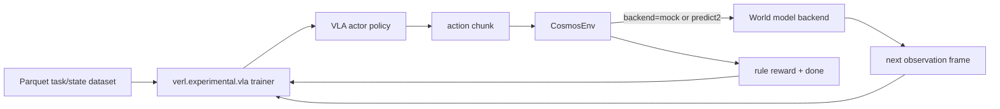
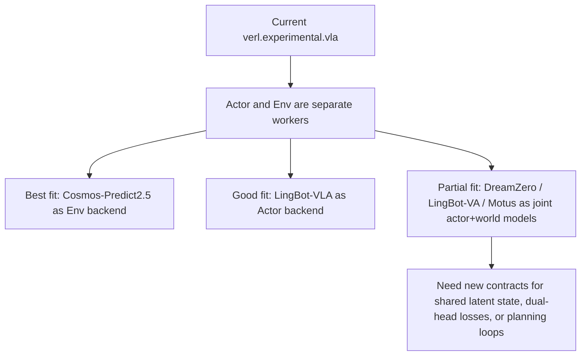

# Cosmos World-Model RL Notes

This note records how the new `simulator_type=cosmos` path fits into `verl.experimental.vla`, and how several recent VLA / world-model repositories relate to RL.

## New `CosmosEnv` path in `verl`

`CosmosEnv` adds a third simulator backend beside `libero` and `isaac`.

The current implementation deliberately separates responsibilities:

- `Cosmos` backend produces the next visual observation.
- `CosmosEnv` keeps a lightweight analytic latent state to compute reward and termination.
- The existing VLA actor remains the RL policy.

That split keeps the environment compatible with the current `verl.experimental.vla` dataflow without redesigning the trainer.

## Roles in RL

### `cosmos-predict2.5`
- Primary role: world model / environment dynamics generator.
- Most relevant path: robot action-conditioned video prediction.
- In `verl`: best used as an `Env.step(action) -> next_obs` backend, one model instance per env GPU worker.
- Limitation: the upstream action-conditioned example documents no native multi-GPU inference inside a single model instance, so `verl` should scale it by worker-level data parallelism instead.

### `cosmos-rl`
- Primary role: RL training framework plus policy / reward service infrastructure.
- In `verl`: more useful as a design reference than a drop-in dependency, because `verl` already owns the trainer, resource pools, and rollout loop.
- Best fit: borrow ideas for reward services, VLA evaluation conventions, and colocated/disaggregated process flow.

### `LingBot-VLA`
- Primary role: actor / policy model.
- It predicts robot action chunks from image + language observations.
- In RL terms, it is closest to the actor or an initialization checkpoint for actor fine-tuning.
- In `verl`: fits naturally as a replacement VLA policy backend, but not as an environment model.

### `LingBot-VA`
- Primary role: joint video-action world model.
- It unifies video prediction and action inference in a single autoregressive diffusion-style architecture.
- In RL terms, it can serve two different roles:
  - actor, when decoding the action stream for control;
  - environment/world model, when rolling visual futures forward under action conditions.
- In `verl`: possible, but awkward for the current separation of actor and env workers because one model owns both semantics.

### `DreamZero`
- Primary role: world-action model used as a zero-shot policy.
- The repo shows a model that predicts actions and future video together, then deploys that model directly as the control policy.
- In RL terms, it behaves more like an actor with an auxiliary world-model head than a standalone environment service.
- In `verl`: partially compatible as an actor backend, but less natural as a pure environment because the training/inference stack is built around joint world-action prediction.

### `Motus`
- Primary role: unified latent action world model.
- It mixes understanding, action, and video experts, and can switch between world-model, VLA, inverse-dynamics, and joint prediction modes.
- In RL terms, it is the most flexible of the set:
  - can be an actor,
  - can be a world model,
  - can be an inverse-dynamics / planning module.
- In `verl`: technically promising, but would require a clearer contract for mode selection and tensor schemas before it becomes a clean backend.

## Fit to current `verl`

### Best immediate fits
- `Cosmos-Predict2.5`: environment backend.
- `LingBot-VLA`: actor backend.

### Partial fits requiring more refactor
- `LingBot-VA`
- `DreamZero`
- `Motus`

These models blur the boundary between policy and world model. `verl` currently assumes a cleaner split: rollout worker produces actions, env worker advances the world. Joint world-action models would either:

- run as the actor and ignore their video head, or
- require a new hybrid worker contract where one model produces both action and predicted next observation.

## Recommended interpretation for this repository

- Use `CosmosEnv + cosmos-predict2.5` when the goal is **RL in a learned environment**.
- Use `LingBot-VLA` when the goal is **swap in a stronger robot actor**.
- Treat `DreamZero`, `LingBot-VA`, and `Motus` as **architecture references for future actor-env fusion**, not as immediate drop-in replacements for the current `verl` separation.
