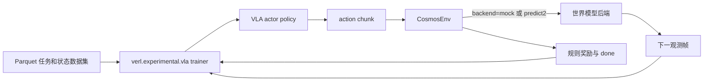
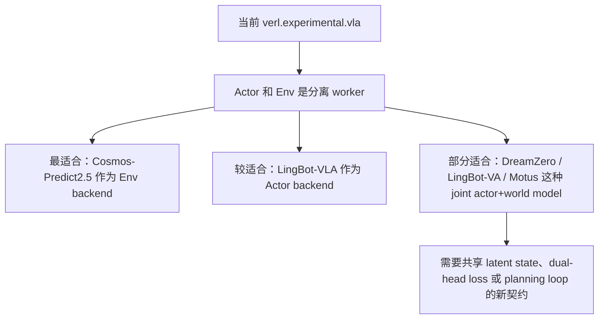

# Cosmos 世界模型 RL 说明

这份说明记录新的 `simulator_type=cosmos` 路径如何接入 `verl.experimental.vla`，以及几类近期 VLA / 世界模型仓库在 RL 中分别扮演什么角色。

## `verl` 中新增的 `CosmosEnv`

`CosmosEnv` 成为继 `libero` 和 `isaac` 之后的第三个模拟器后端。

当前实现故意做了职责拆分：

- `Cosmos` backend 负责生成下一时刻视觉观测。
- `CosmosEnv` 维护轻量 latent state 来计算 reward 与 termination。
- 现有 VLA actor 仍然是 RL 策略本身。

这种拆分让它能兼容当前 `verl.experimental.vla` 的数据流，而不需要重写 trainer。

## 在 RL 里的角色

### `cosmos-predict2.5`
- 主要角色：世界模型 / 环境动力学生成器。
- 在 `verl` 里的最佳用法：作为 `Env.step(action) -> next_obs` 的环境后端，每张环境 GPU 跑一个模型实例。
- 限制：上游 action-conditioned 例子没有单实例原生多卡推理，因此更适合做 worker 级数据并行扩展。

### `cosmos-rl`
- 主要角色：RL 训练框架以及 policy / reward 服务基础设施。
- 在 `verl` 里的价值：更像设计参考而不是直接依赖，因为 `verl` 自己已经拥有 trainer、resource pool 和 rollout loop。

### `LingBot-VLA`
- 主要角色：actor / policy model。
- 在 `verl` 里：很适合替换 VLA actor，但不适合拿来当环境模型。

### `LingBot-VA`
- 主要角色：联合 video-action 世界模型。
- 在 RL 里：既可能是 actor，也可能是 environment/world model。
- 在 `verl` 里：可行但会别扭，因为当前 `verl` 假设 actor worker 和 env worker 是分开的。

### `DreamZero`
- 主要角色：把 world-action model 直接当 zero-shot policy。
- 在 `verl` 里：更像 actor backend，而不是纯环境服务。

### `Motus`
- 主要角色：统一 latent action world model。
- 在 RL 里：既能做 actor，也能做 world model，还能做 inverse dynamics / planning module。
- 在 `verl` 里：潜力很大，但需要更清晰的 mode contract 和 tensor schema。

## 对当前 `verl` 的适配判断

## 更适合当前仓库的解释方式

- 如果目标是 **在学习到的环境里做 RL**，优先考虑 `CosmosEnv + cosmos-predict2.5`。
- 如果目标是 **替换成更强的机器人 actor**，优先看 `LingBot-VLA`。
- `DreamZero`、`LingBot-VA`、`Motus` 更适合作为未来 actor-env 融合框架的设计参考，而不是当前 `verl` 分离式结构下的直接替换物。
